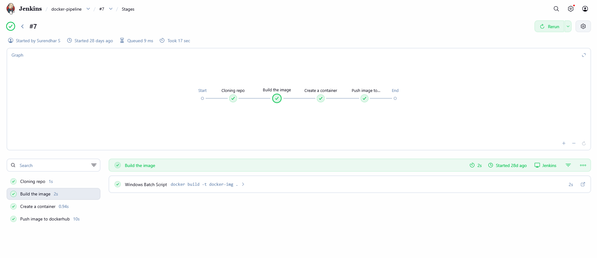
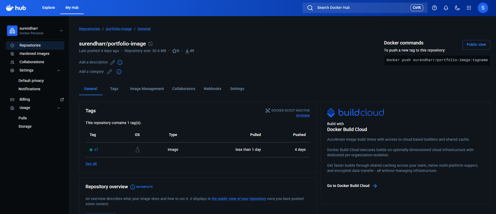
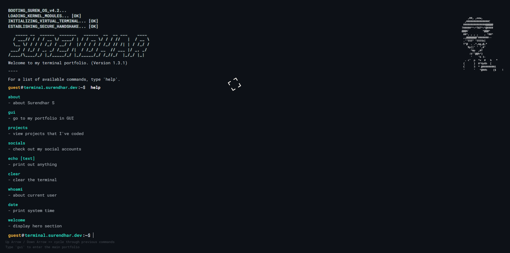

# 🚀 CI/CD Pipeline for React Portfolio Application

## 📌 Overview
This project implements an end-to-end CI/CD pipeline to automate the build and deployment of a React-based portfolio application using Jenkins and Docker. It ensures faster, consistent, and reliable application delivery.

---

## 🎯 Objective
To automate the application build and deployment process using CI/CD practices, reducing manual effort and improving reliability.

---

## 🏗️ Architecture
```bash
GitHub → Jenkins → Docker → Docker Hub
```

---

## ⚙️ Tech Stack
- React.js  
- Jenkins  
- Docker  
- Docker Hub  
- Git & GitHub  

---

## 🔄 Workflow
1. Developer pushes code to GitHub  
2. Jenkins pipeline is triggered  
3. Application build process starts  
4. Docker image is created  
5. Image is pushed to Docker Hub  

---

## 🛠️ Implementation
- Configured Jenkins pipeline using Declarative syntax  
- Integrated GitHub with Jenkins using webhook  
- Created Dockerfile using multi-stage build  
- Configured Docker Hub credentials in Jenkins  
- Automated image build and push process  

---

## 📂 Project Structure
```bash
react-cicd-docker-jenkins/
├── app/
├── Dockerfile
├── Jenkinsfile
├── .gitignore
├── README.md
└── screenshots/
```

---

## 📸 Screenshots

### Jenkins Pipeline


### Docker Hub Image


### Application output


---

## 🚧 Challenges
- Docker build issues  
- Jenkins credential configuration  
- Pipeline debugging  

---

## 📈 Outcome
- Automated build and deployment  
- Reduced manual effort  
- Improved deployment consistency  

---

## 🚀 Future Improvements
- Deploy to Kubernetes (EKS)  
- Add monitoring tools  
- Integrate automated testing  

---

## 📌 Summary
Implemented a CI/CD pipeline using Jenkins and Docker to automate build and delivery of a React application.
